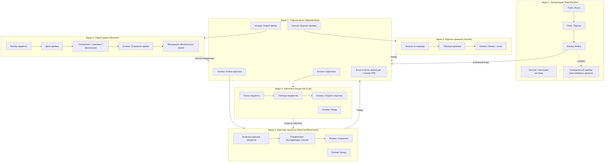

# Прототип интерфейса (wireframe) для ВКР: Firamir

Ниже представлен прототип основных экранов системы в формате `Mermaid`.
Диаграмма показывает структуру экранов и пользовательские переходы.

## Комментарии к макету

- Переход из `Авторизации` в `Главное меню` выполняется только при корректных учетных данных.
- Экран `Главное меню` является центральным узлом навигации по системе.
- В `Картотеке` пользователь может найти пациента и открыть его карточку для редактирования.
- Экран `Новый прием` содержит обязательную проверку полей перед сохранением.
- Из `Журнала` доступны фильтрация данных и запуск печати/формирования отчета.

## Что показать в защите

- Логику переходов: `Вход -> Главное меню -> рабочие экраны`.
- Где выполняется ввод, где просмотр, где сохранение данных.
- Какие экраны связаны с отчетами и какие с первичным вводом данных.
